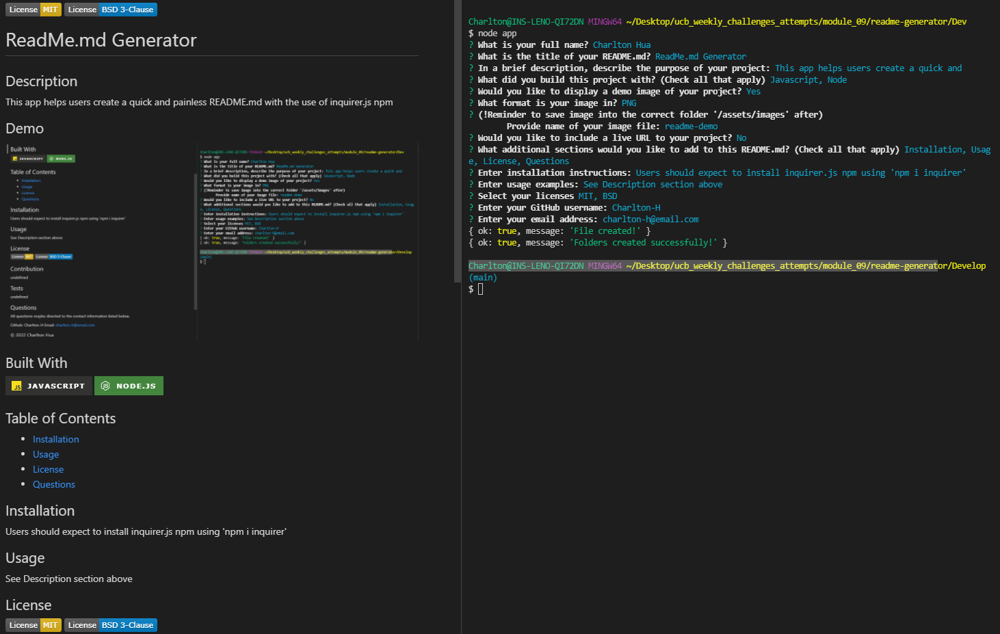

 

# ReadMe.md Generator

## Description

This app helps users create a quick and painless README.md with the use of inquirer.js npm

## Demo

## Built With

 

## Table of Contents

- [Installation](#Installation)
- [Usage](#Usage)
- [License](#License)
- [Questions](#Questions)

## Installation

Users should expect to install inquirer.js npm using 'npm i inquirer'

## Usage

See Description section above

## License

 

## Questions

All questions maybe directed to the contact information listed below.

Github: Charlton-H
Email: charlton-h@email.com

### &copy; 2022 Charlton Hua
